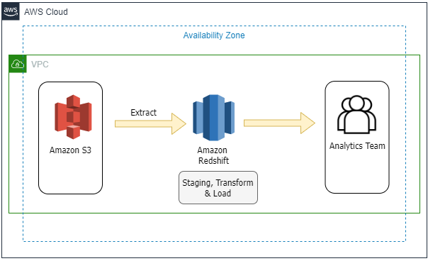
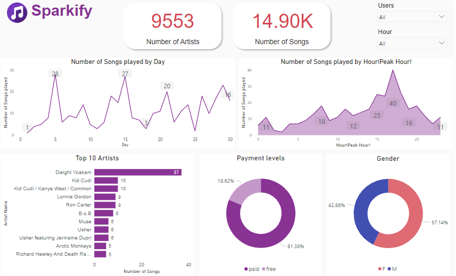

[](https://)
[](https://)

# Data Warehouse With Amazon Redshift and Visualizing Redshift data using Power BI

## Introduction
A music streaming startup, Sparkify, has grown their user base and song database and want to move their processes and data onto the cloud. Their data resides in S3, in a directory of JSON logs on user activity on the app, as well as a directory with JSON metadata on the songs in their app.

As their data engineer, you are tasked with building an ETL pipeline that extracts their data from S3, stages them in Redshift, and transforms data into a set of dimensional tables for their analytics team to continue finding insights into what songs their users are listening to.

## Project Dataset
There are two datasets that reside in S3:

- Song data: `s3://udacity-dend/song_data`
- Log data: `s3://udacity-dend/log_data`

Log data json path: `s3://udacity-dend/log_json_path.json`

#### Song Dataset
The first dataset is a subset of real data from the Million Song Dataset. Each file is in JSON format and contains metadata about a song and the artist of that song. The files are partitioned by the first three letters of each song's track ID. For example, here are file paths to two files in this dataset.
```
song_data/A/B/C/TRABCEI128F424C983.json
song_data/A/A/B/TRAABJL12903CDCF1A.json
```
#### Log Dataset
The second dataset consists of log files in JSON format generated by this event simulator based on the songs in the dataset above. These simulate activity logs from a music streaming app based on specified configurations.

The log files in the dataset you'll be working with are partitioned by year and month. For example, here are filepaths to two files in this dataset.
```
log_data/2018/11/2018-11-12-events.json
log_data/2018/11/2018-11-13-events.json
```

## Project Files

1. `create_tables.py`: Creating the fact and dimension tables for the star schema in Redshift.
2. `etl.py`: Is where will load data from S3 into staging tables on Redshift and then process that data into your analytics tables on Redshift.
3. `sql_queries.py`: Contains all sql queries, and is imported into the two files above.
4. `dwh.cfg`: Conatians Redshift database and IAM Role info.
5. `analysis.ipynb`: Contains sql queries and data visualization after loading data. 
6. `README.md`: provides discussion on the project.

## Redshift Cluster
1. Create Redshift IAM Role and On the **Attach permissions policies** page, search for and select the **AmazonS3ReadOnlyAccess**.
2. Create Security Group (through the EC2 security group) to authorize access to the Redshift cluster.
3. Create Redshift cluster, then put the database info and `arn` in dwh.confg file.
4. Delete the Redshift cluster when finished.

## Database Schema Design


#### Staging Tables:
1. ***staging_event***: for log data.
2. ***staging_song***: for song data.

#### Fact Table:
1. ***songplays***: records in log data associated with song plays i.e. records with page NextSong
        -songplay_id, start_time, user_id, level, song_id, artist_id, session_id, location, user_agent
        
#### Dimension Tables
1. ***users*** - users in the app
        -user_id, first_name, last_name, gender, level
2. ***songs*** - songs in music database
        -song_id, title, artist_id, year, duration
3. ***artists*** - artists in music database
        -artist_id, name, location, latitude, longitude
4. ***time*** - timestamps of records in songplays broken down into specific units
        -start_time, hour, day, week, month, year, weekday

## ETL Pipeline

The ETL Pipeline consists of 2 steps:
1. Load data from S3 to staging tables on Redshift.
2. Execute SQL statements in `sql_queries.py` that create the analytics tables from these staging tables.

First, I will extract data from S3 and staging them in Redshift using `COPY` Command. The staging tables are: `staging_event` & `staging_song`.
Transform data into a set of dimensional tables and fact table with Star Schema. Then, load data from staging tables to analytics tables on Redshift with `INSERT INTO` statment.
To avoid duplication data, use `SELECT DISTINCT`.

The architecture below shows the Data Flow:



## How to run the Python Scripts

#### To create tables
1. Run `create_tables.py` to create your database and tables.
  ``` python create_tables.py```
  
#### To run ETL pipeline
2. Run `etl.py`, Remember to run `create_tables.py` before running `etl.py`.
  ``` python etl.py```

## Analysis
After loading data, I created some SQL queries and Visualization.

#### Here's an exmple of SQL queries:
 ```
 df_song = pd.read_sql("SELECT  COUNT(*) FROM song;", conn)
     df_song
 >> 14896
 ```
## Visualize Redshift data with Power BI
Connect Power BI to Redshift to create dashboard:
1. To connect to an Amazon Redshift database, select Get data > Database > Amazon Redshift.
2. In the Amazon Redshift window that appears, type your Amazon Redshift Server and Database.
3. Then put in your username and password.
4. Once you successfully connect, click load > Import.
5. Build your Dashboard. 




## Author
Esraa Ahmed | <a href="https://linkedin.com/in/esraa-ahmed-ibrahim2" target="blank"></a>
