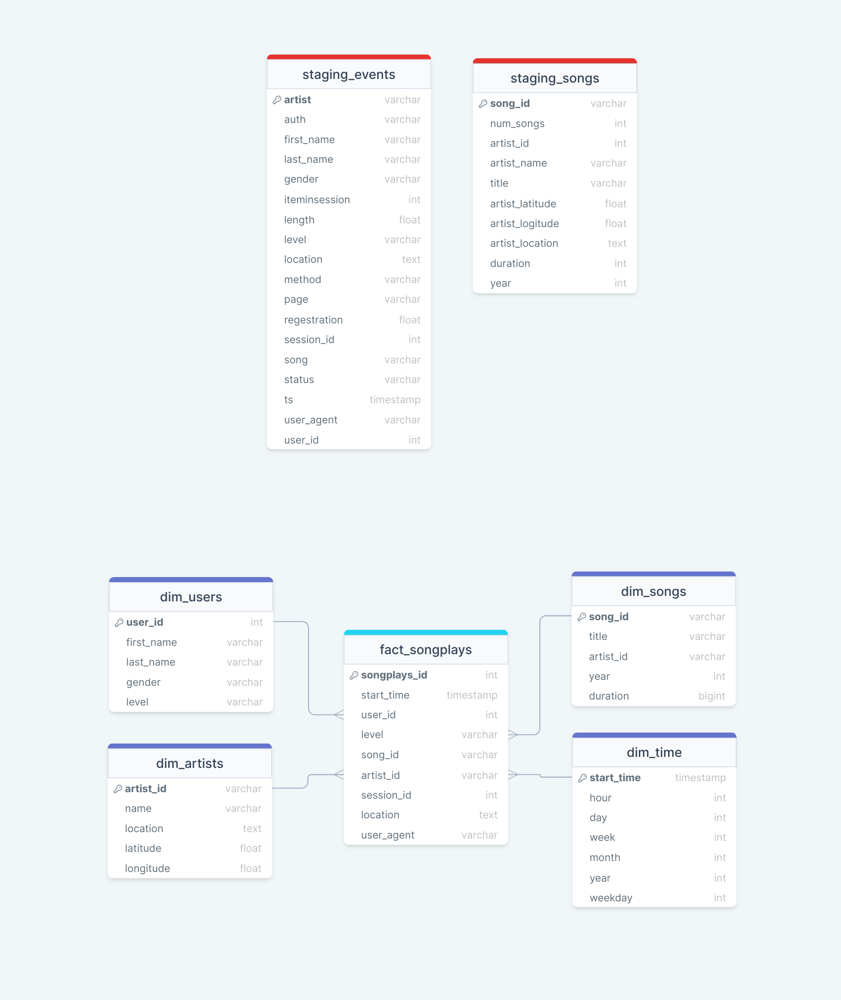
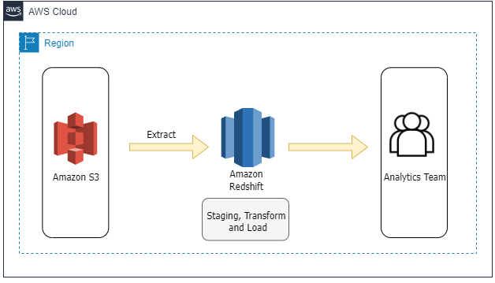

[](https://)
[](https://)

# Data Warehouse With Amazon Redshift

### Introduction
A music streaming startup, Sparkify, has grown their user base and song database and want to move their processes and data onto the cloud. Their data resides in S3, in a directory of JSON logs on user activity on the app, as well as a directory with JSON metadata on the songs in their app.

As their data engineer, you are tasked with building an ETL pipeline that extracts their data from S3, stages them in Redshift, and transforms data into a set of dimensional tables for their analytics team to continue finding insights into what songs their users are listening to.

### Project Description
1. Define fact and dimension tables for a star schema.
2. Write an ETL pipeline that transfers data from files in two local directories into these tables in Postgres using Python and SQL.

### Project Dataset
There are two datasets that reside in S3:

- Song data: `s3://udacity-dend/song_data`
- Log data: `s3://udacity-dend/log_data`

Log data json path: `s3://udacity-dend/log_json_path.json`

#### Song Dataset
The first dataset is a subset of real data from the Million Song Dataset. Each file is in JSON format and contains metadata about a song and the artist of that song. The files are partitioned by the first three letters of each song's track ID. For example, here are file paths to two files in this dataset.
```
song_data/A/B/C/TRABCEI128F424C983.json
song_data/A/A/B/TRAABJL12903CDCF1A.json
```
And below is an example of what a single song file, TRAABJL12903CDCF1A.json, looks like.

```
{"num_songs": 1, "artist_id": "ARJIE2Y1187B994AB7", "artist_latitude": null, "artist_longitude": null, "artist_location": "", "artist_name": "Line Renaud", "song_id": "SOUPIRU12A6D4FA1E1", "title": "Der Kleine Dompfaff", "duration": 152.92036, "year": 0}
```

#### Log Dataset
The second dataset consists of log files in JSON format generated by this event simulator based on the songs in the dataset above. These simulate activity logs from a music streaming app based on specified configurations.

The log files in the dataset you'll be working with are partitioned by year and month. For example, here are filepaths to two files in this dataset.
```
log_data/2018/11/2018-11-12-events.json
log_data/2018/11/2018-11-13-events.json
```

### Project Template
Project files<br>

1. `create_tables.py`: Creating the fact and dimension tables for the star schema in Redshift.
2. `etl.py`: Is where will load data from S3 into staging tables on Redshift and then process that data into your analytics tables on Redshift.
3. `sql_queries.py`: Contains all sql queries, and is imported into the two files above.
4. `dwh.cfg`: Conatians Redshift database and IAM Role info.
6. `README.md`: provides discussion on the project.

### Database Schema Design



#### Fact Table:
1. ***songplays***: records in log data associated with song plays i.e. records with page NextSong
        -songplay_id, start_time, user_id, level, song_id, artist_id, session_id, location, user_agent
        
#### Dimension Tables
1. ***users*** - users in the app
        -user_id, first_name, last_name, gender, level
2. ***songs*** - songs in music database
        -song_id, title, artist_id, year, duration
3. ***artists*** - artists in music database
        -artist_id, name, location, latitude, longitude
4. ***time*** - timestamps of records in songplays broken down into specific units
        -start_time, hour, day, week, month, year, weekday

### ETL pipeline
The ETL pipeline will process the data from JSON files `song_data` and `log_data` to create database using Python and SQL.
`song_data` To create the songs and artists dimensional tables.
`log_data` To create the time and users dimensional tables, as well as the songplays fact table.




### How to run the Python Scripts

#### To create tables
1. Run `create_tables.py` to create your database and tables.
  ``` python create_tables.py```
  
#### To run ETL pipeline
2. Run `etl.py`, Remember to run `create_tables.py` before running `etl.py` to reset your tables.
  ``` python etl.py```


### Example query

```
SELECT count(*) FROM songs
```
### Author
Esraa Ahmed | <a href="https://linkedin.com/in/esraa-ahmed-ibrahim2" target="blank"></a>
